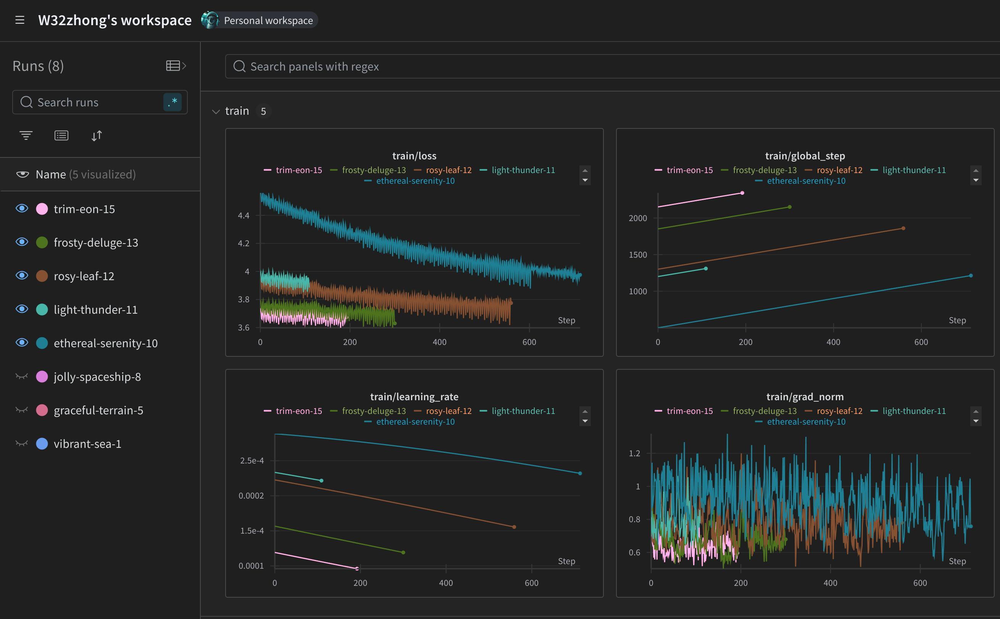

## Baby LLaMA
```
hardware = 2 x RTX3060
batch size = 2,560 (1.5K to 4K according to *Cramming BERT* [1])
model parameters = 16,585,216 (check out the original BabyLlama repo [2])
dataset = HuggingFaceFW/fineweb-edu (46 GiB disk space)
training tokens = sample-10BT (best be ~20 tokens/parameter per *Chinchilla law* [2])
training samples = 9,672,101
training steps = 3,778
time per step = 150 sec/step
time estimated = 156:42:50 (about 6.5 days)
```

## Example output
```
<s> Baby Llama is a 25-year-old woman who is with the world child and a year old.
She is one of the most popular young women. In 2001, and the world is the world’s
second largest child to become an infant, as we’ve worked together to develop an
adult child. We don’t yet know whether or not life was enough to help each of us?
Children need to be more aware of their socialization, skills, or concerns. They
may not be the first to get enough sleep, nor are they working hard on it.
```
(from Checkpoint-2300)

## Wandb logs


## Reference
1. Cramming BERT (https://arxiv.org/pdf/2212.14034)
2. Original BabyLlama size configurations (https://github.com/timinar/BabyLlama/tree/main/config)
3. Chinchilla Law (https://arxiv.org/abs/2203.15556)
